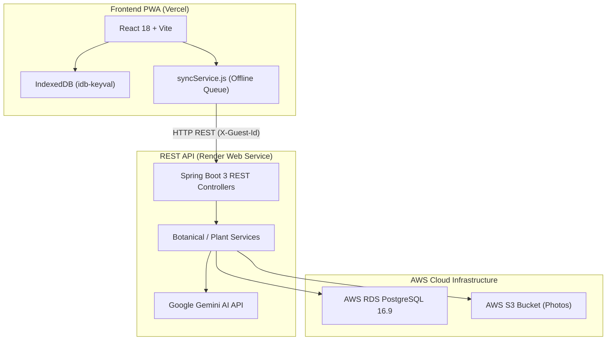

[Versao em Portugues / Portuguese Version](./README.md)

---

# CANTO ALEGRE - SMART PLANT & GARDENING GUIDE

### ACCESS THE LIVE PUBLIC APP NOW:
### [HTTPS://CANTO-ALEGRE-NINE.VERCEL.APP](https://canto-alegre-nine.vercel.app)

---

<!-- Placeholder space for project banner image -->
<div align="center">
  
  <p><em>Canto Alegre - Smart botanical assistant powered by Google Gemini AI, 100% Offline PWA and AWS Cloud.</em></p>
</div>

---

## 1. What is Canto Alegre?

**Canto Alegre** is a personal gardening and botanical identification assistant built with a decentralized, highly resilient architecture. The project combines a **100% Offline-First PWA Client (React 18 + Vite + IndexedDB)** with a **Java 21 / Spring Boot 3 REST Microservices API** connected to an **AWS RDS PostgreSQL 16.9** relational database, **AWS S3** photo storage, and **Google Gemini LLM** Multimodal AI.

With Canto Alegre, users can:
- Take a photo or type any plant species name to receive comprehensive care advice.
- Discover exact watering amounts, sunlight requirements, and the **Ideal Environment** for each plant (e.g. Living Room, Bedroom, Balcony, Bathroom, or Backyard).
- Follow safe step-by-step instructions for plant propagation and cuttings.
- Keep their garden journal saved locally without needing internet, auto-syncing with the cloud whenever reconnected.

---

## 2. Inspiration & Background

This project originated from hands-on volunteering experiences through **Worldpackers** as a gardener and green space caretaker across eco-lodges, hostels, and agroecological farms. In the field, identifying native plants, managing watering cycles across microclimates, and taking cuttings to multiply garden beds were daily challenges.

**Canto Alegre** was created to connect practical soil wisdom with state-of-the-art AI and modern web/cloud technologies.

---

## 3. Core Features

- **Photo Identification & Multimodal AI**: Point the camera or upload a photo. Google Gemini AI analyzes leaves, veins, and flowers to recognize species name, origin, soil, and care instructions.
- **Ideal Environment ("Where it Belongs")**: Automatic classification whether a plant prefers indoor (living room, bedroom, bathroom) or outdoor (balcony, backyard) spaces, with instant garden filters.
- **New Add Plant Flow with Initial Question**: Interactive prompt *"Do you already know the plant's name?"* offering smart auto-complete care guides and cutting instructions.
- **Comprehensive Cutting & Propagation Guide**: Step-by-step botanical propagation by stem cuttings, leaf cuttings, or clump division with expert tips.
- **Offline-First Architecture & Cloud Synchronization**: Instant local storage in IndexedDB with an offline queue (`syncService.js`) that syncs with the REST API upon network reconnection.
- **Interactive Spotlight Tour**: Guided step-by-step walkthrough highlighting main app buttons for new users.
- **Social Meta Tags & Silent Telemetry**: Open Graph and Twitter Cards for social media sharing, accompanied by privacy-friendly engagement metrics.

---

## 4. Ecosystem Architecture & Tech Stack



| Layer | Technology / Service | Purpose in Ecosystem |
| :--- | :--- | :--- |
| **Frontend PWA** | React 18, Vite 5, Lucide Icons | Responsive, installable (Android/iOS), 100% offline-first user interface. |
| **Web Hosting** | Vercel | Continuous deployment of frontend with SSL HTTPS and public domain. |
| **Backend REST API** | Java 21, Spring Boot 3 | Stateless microservices API with RFC 7807 (ProblemDetail) error handling. |
| **API Web Hosting** | Render.com | 24/7 Docker container hosting for Spring Boot API. |
| **Database** | AWS RDS PostgreSQL 16.9 | User, botanical species, and watering history database managed with Flyway. |
| **Image Storage** | AWS S3 Bucket | Secure cloud storage for user-uploaded plant photos via multipart upload. |
| **Artificial Intelligence** | Google Gemini LLM API | Visual species recognition and automated botanical guide generation. |

---

## 5. Studies & Dedicated Documentation Index

For an in-depth exploration of architecture, Spring/Java annotations, AWS setups, and deployment guides, refer to the `studies/` directory:

| Document | Content & Description |
| :--- | :--- |
| **[studies/README.md](studies/README.md)** | Index of architectural study manuals. |
| **[studies/01-ROADMAP_E_ARQUITETURA.md](studies/01-ROADMAP_E_ARQUITETURA.md)** | Development roadmap, sequence diagrams, and hybrid sync. |
| **[studies/02-GUIA_DE_ANOTACOES_JAVA_SPRING.md](studies/02-GUIA_DE_ANOTACOES_JAVA_SPRING.md)** | Complete guide to Spring Boot, JPA/Hibernate, Validation, Lombok, and Test annotations. |
| **[studies/03-RASTREABILIDADE_E_ETAPA2_STORAGE.md](studies/03-RASTREABILIDADE_E_ETAPA2_STORAGE.md)** | Feature traceability and storage overview. |
| **[studies/04-GUIA_PASSO_A_PASSO_AWS_CLOUD.md](studies/04-GUIA_PASSO_A_PASSO_AWS_CLOUD.md)** | Step-by-step AWS setup (IAM Console, S3 Bucket, RDS PostgreSQL, and Deployment). |
| **[studies/05-GUIA_DE_LANCAMENTO_E_TELEMETRIA.md](studies/05-GUIA_DE_LANCAMENTO_E_TELEMETRIA.md)** | Public launch guide, Vercel/Netlify deployment, Open Graph, and Telemetry. |

---

## 6. How to Run Locally

### 6.1. Running Backend REST API (`api/`)

```bash
# 1. Navigate to API folder
cd api

# 2. Start PostgreSQL container via Docker Compose
docker-compose up -d

# 3. Execute unit and integration tests (Testcontainers)
./mvnw test

# 4. Run Spring Boot application (Port 8080)
./mvnw spring-boot:run
```

### 6.2. Running Frontend PWA

```bash
# 1. In project root, install dependencies
npm install

# 2. Start Vite development server
npm run dev

# 3. Create production build
npm run build
```

---

## 7. How to Contribute

Community contributions are welcome. Please refer to:
- **[CONTRIBUTING.md](CONTRIBUTING.md)**: Contribution rules and coding standards.
- **[CHANGELOG.md](CHANGELOG.md)**: Version history and project updates.

---

## 8. License

Distributed under the MIT License.
