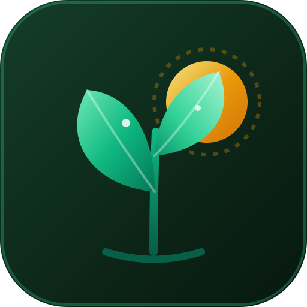
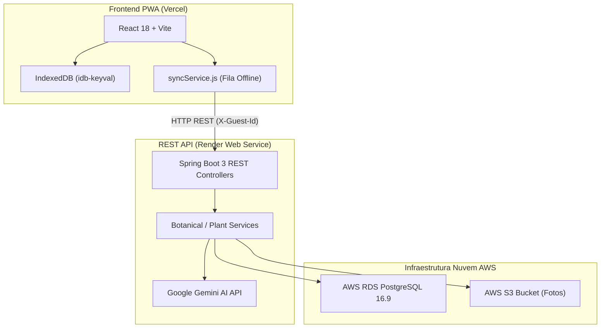

[English Version / Versao em Ingles](./README.en.md) | [Modelos de Publicacao para o LinkedIn](./LINKEDIN_POSTS.md)

---

# CANTO ALEGRE - GUIA DE PLANTAS & JARDINAGEM INTELIGENTE

### ACESSE O APLICATIVO PUBLICO NO AR AGORA:
### [HTTPS://CANTO-ALEGRE-NINE.VERCEL.APP](https://canto-alegre-nine.vercel.app)

---

<!-- Espaco reservado para imagem de capa do projeto -->
<div align="center">
  
  <p><em>Canto Alegre - Assistente botanico inteligente com IA Google Gemini, PWA 100% Offline e Nuvem AWS.</em></p>
</div>

---

## 1. O que e o Canto Alegre?

O **Canto Alegre** e um assistente pessoal de jardinagem e identificacao botanica desenvolvido com arquitetura descentralizada e resiliente. O projeto combina um **PWA Client (React 18 + Vite + IndexedDB)** com funcionamento 100% offline a uma **REST API de Microsservicos em Java 21 / Spring Boot 3** integrada ao banco de dados relacional **AWS RDS PostgreSQL 16.9**, armazenamento de fotos no **AWS S3** e Inteligencia Artificial Multimodal **Google Gemini LLM**.

Com o Canto Alegre, o usuario pode:
- Fotografar ou digitar o nome de qualquer especie para receber diagnósticos completos de cultivo.
- Saber a frequencia e volume exatos de agua, quantidade de sol e **Ambiente Ideal** onde posicionar o vaso (ex.: sala, quarto, varanda, banheiro ou quintal).
- Aprender o passo a passo seguro para multiplicar a planta através do **Guia de Mudas & Estaquia**.
- Manter seu diário de cultivo salvo localmente sem precisar de internet, sincronizando na nuvem assim que reconectar.

---

## 2. Inspiracao & Origem

Este projeto nasceu da vivencia pratica durante **voluntariados no Worldpackers** atuando como jardineiro e cuidador de espaços verdes em eco-pousadas, hostels e fazendas agroecologicas. No campo, identificar plantas nativas, entender ciclos de rega sob climas variados e tirar mudas para multiplicar os canteiros eram desafios diarios. 

O **Canto Alegre** foi criado para conectar esse aprendizado pratico da terra com o que ha de mais avancado em IA e tecnologias web/cloud modernas.

---

## 3. Funcionalidades Principais

- **Identificacao Botanica por Foto & IA Multimodal**: Aponte a camera ou escolha uma foto da galeria. A IA analisa folhas, nervuras e flores para identificar nome popular/cientifico, origem, solo e cuidados.
- **Ambiente Ideal da Planta ("Onde Fica")**: Classificacao automatica se a especie prefere interior (sala, quarto, banheiro) ou exterior (varanda, quintal), com filtro instantâneo no jardim.
- **Novo Fluxo de Adicao com Pergunta Inicial**: Fluxo interativo *"Voce ja conhece o nome da planta?"* com auto-complete inteligente de cuidados e guia de mudas via IA Gemini.
- **Guia Completo de Mudas & Estaquia**: Passo a passo botanico de multiplicacao por estaca de caule, folha ou divisao de touceiras com dicas profissionais.
- **Arquitetura Offline-First & Sincronizacao Cloud**: Armazenamento instantâneo no IndexedDB local com fila offline (`syncService.js`) que descarrega os dados na REST API ao reconectar a rede.
- **Spotlight Tour Interativo**: Tour guiado com destaque iluminado nos botoes principais para novos usuarios.
- **Social Meta Tags & Telemetria Silenciosa**: Suporte a Open Graph e Twitter Cards para compartilhamento em redes sociais e rastreamento seguro de engajamento.

---

## 4. Arquitetura do Ecossistema & Tecnologias



| Camada | Tecnologia / Servico | Finalidade no Ecossistema |
| :--- | :--- | :--- |
| **Frontend PWA** | React 18, Vite 5, Lucide Icons | Interface do usuario responsiva, instalável em Android/iOS e offline-first. |
| **Hospedagem Web** | Vercel | Deploy continuo do frontend com SSL HTTPS e dominio publico. |
| **Backend REST API** | Java 21, Spring Boot 3 | API de microsservicos stateless com tratamento de erro RFC 7807 (ProblemDetail). |
| **API Web Hosting** | Render.com | Hospedagem 24/7 do container Docker Spring Boot. |
| **Banco de Dados** | AWS RDS PostgreSQL 16.9 | Armazenamento de usuarios, especies botanicas e historico de regas com Flyway Migrations. |
| **Storage de Imagens** | AWS S3 Bucket | Armazenamento de fotos de plantas enviadas pelos usuarios via upload multipart. |
| **Inteligencia Artificial** | Google Gemini LLM API | Reconhecimento visual de especies e geracao automatica do guia botanico. |

---

## 5. Guia de Estudos & Documentacao Dedicada

Para uma imersao aprofundada na arquitetura, anotações Java/Spring, comandos AWS e guia de deploy, consulte os documentos na pasta `studies/`:

| Documento | Conteudo e Descricao |
| :--- | :--- |
| **[studies/README.md](studies/README.md)** | Indice completo de todos os manuais de estudo arquiteturais. |
| **[studies/01-ROADMAP_E_ARQUITETURA.md](studies/01-ROADMAP_E_ARQUITETURA.md)** | Roadmap de desenvolvimento, diagramas de sequencia e sincronizacao hibrida. |
| **[studies/02-GUIA_DE_ANOTACOES_JAVA_SPRING.md](studies/02-GUIA_DE_ANOTACOES_JAVA_SPRING.md)** | Guia completo de anotações Spring Boot, JPA/Hibernate, Validation, Lombok e Testes. |
| **[studies/03-RASTREABILIDADE_E_ETAPA2_STORAGE.md](studies/03-RASTREABILIDADE_E_ETAPA2_STORAGE.md)** | Rastreabilidade de recursos (como fazer/desfazer) e visao geral do storage. |
| **[studies/04-GUIA_PASSO_A_PASSO_AWS_CLOUD.md](studies/04-GUIA_PASSO_A_PASSO_AWS_CLOUD.md)** | Passo a passo de configuracao AWS (Console IAM, S3 Bucket, RDS PostgreSQL e Deploy). |
| **[studies/05-GUIA_DE_LANCAMENTO_E_TELEMETRIA.md](studies/05-GUIA_DE_LANCAMENTO_E_TELEMETRIA.md)** | Manual de lancamento publico, deploy na Vercel/Netlify, Open Graph e Telemetria. |

---

## 6. Como Executar o Projeto Localmente

### 6.1. Executando o Backend REST API (`api/`)

```bash
# 1. Navegue para a pasta da API
cd api

# 2. Inicie o container PostgreSQL via Docker Compose
docker-compose up -d

# 3. Executar os testes unitarios e de integracao (Testcontainers)
./mvnw test

# 4. Iniciar a aplicacao Spring Boot (Porta 8080)
./mvnw spring-boot:run
```

### 6.2. Executando o Frontend PWA

```bash
# 1. Na raiz do projeto, instale as dependencias
npm install

# 2. Inicie o servidor de desenvolvimento Vite
npm run dev

# 3. Gerar o build de producao
npm run build
```

---

## 7. Como Contribuir

Contribuições da comunidade sao muito bem-vindas. Consulte os guias:
- **[CONTRIBUTING.md](CONTRIBUTING.md)**: Regras de contribuicao e padroes de codigo.
- **[CHANGELOG.md](CHANGELOG.md)**: Historico de versoes e melhorias do projeto.

---

## 8. Licença

Distribuido sob a Licença MIT.
