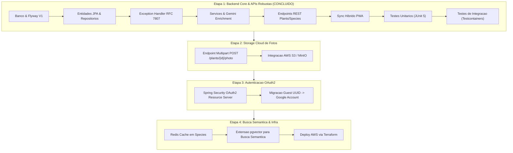
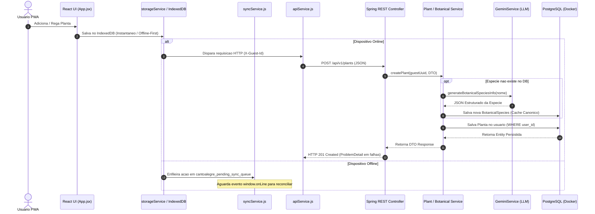

# Roadmap & Arquitetura de Integracao: Canto Alegre API

Este documento detalha o roadmap de desenvolvimento do ecossistema **Canto Alegre**, a evolucao da arquitetura cliente-servidor e a comunicacao entre os modulos do sistema.

---

## 1. Visao Geral do Produto & Transicao de Escopo

O projeto iniciou-se como um PWA (React 18 + Vite + IndexedDB via `idb-keyval`) com capacidade de funcionamento 100% offline para gerenciamento de jardim e identificacao botânica local.

O escopo evoluiu para a construcao de uma API de microsservicos dedicada em **Java 21 / Spring Boot 3 + PostgreSQL 16**, provendo:
- Sincronizacao na nuvem sem perder a resiliencia offline.
- Catalogo botanico canonico compartilhado no banco de dados.
- Enriquecimento inteligente de especies via Google Gemini LLM.
- Modelo de seguranca anonomo Guest-First por UUID v4 (`X-Guest-Id`).

---

## 2. Roadmap das Fases de Desenvolvimento

---

## 3. Arquitetura de Comunicacao entre Modulos

### 3.1. Diagrama de Fluxo Ponta a Ponta

---

## 4. Decisões Arquiteturais Estrategicas

### 4.1. Guest-First Multi-Tenancy via UUID Stateless
- O PWA gera e armazena localmente um `guest_id` (UUID v4) no IndexedDB.
- Cada requisicao enviada ao backend inclui o cabeçalho HTTP `X-Guest-Id: <UUID>`.
- O `UserService` busca ou cria o registro correspondente na tabela `users` do PostgreSQL.
- O isolamento entre usuarios e garantido via SQL estrito (`WHERE user_id = :userId`), sem carregar estado de sessao em memoria na JVM.

### 4.2. Fluxo de Enriquecimento Botanico & Cache Canonico
1. O usuario digita o nome de uma planta (ex.: "Costela-de-Adão").
2. O `BotanicalSpeciesService` pesquisa no PostgreSQL (`botanical_species`) por nome comum ou cientifico (ignorando maiusculas/minusculas).
3. Caso **nao exista**, o `GeminiService` consulta a API de texto do Google Gemini gerando os dados de rega, sol, solo e propagacao.
4. O resultado e salvo no PostgreSQL como **cache canonico**, de forma que as proximas consultas de qualquer usuario sejam instantâneas sem consumo de cota da LLM.

### 4.3. Resiliencia Offline-First no PWA
1. Qualquer acao (criar planta, regar) grava **imediatamente no IndexedDB** do navegador para garantir resposta instantânea da interface.
2. Em segundo plano, a chamada HTTP e enviada à API Spring Boot.
3. Se a conexao falhar, a operacao e registrada na fila `cantoalegre_pending_sync_queue`.
4. Ao restabelecer a conexao (`online`), o `syncService.js` descarrega a fila e reconcilia os dados locais com a nuvem.
